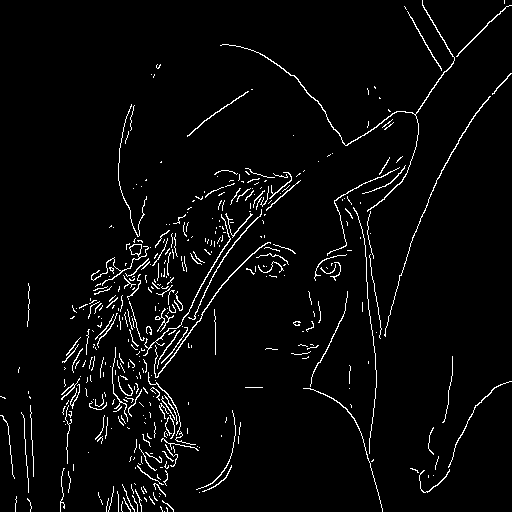

# 可导的Canny边缘检测

# Differentiable Canny Edge Detector

### Example:




### Usage:

```python
import torch
from PIL import Image
from torchvision.transforms.functional import to_tensor
from torchvision.utils import save_image

from canny import CannyEdgeDetector


def main():
    path = r"Lena.png"
    img = Image.open(path).convert('L')
    img = to_tensor(img).unsqueeze(0).to('cuda')
    img.requires_grad = True
    canny = CannyEdgeDetector(5, 1, 0.23, 0.3).to('cuda')
    edges: torch.Tensor = canny(img)
    edges.sum().backward()
    save_image(edges, fp='edge.png')


if __name__ == '__main__':
    main()
```

to see **binary** edges:

```python
import torch
from PIL import Image
from torchvision.transforms.functional import to_tensor
from torchvision.utils import save_image

from canny import CannyEdgeDetector, binaryzation_edge


def main():
    path = r"Lena.png"
    img = Image.open(path).convert('L')
    img = to_tensor(img).unsqueeze(0).to('cuda')
    img.requires_grad = True
    canny = CannyEdgeDetector(5, 1, 0.23, 0.3).to('cuda')
    edges: torch.Tensor = canny(img)
    edges.sum().backward()
    save_image(edges, fp='edge.png')
    binary_edges = binaryzation_edge(edges)
    save_image(binary_edges, 'binary_edge.png')


if __name__ == '__main__':
    main()
```
